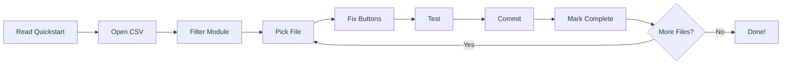
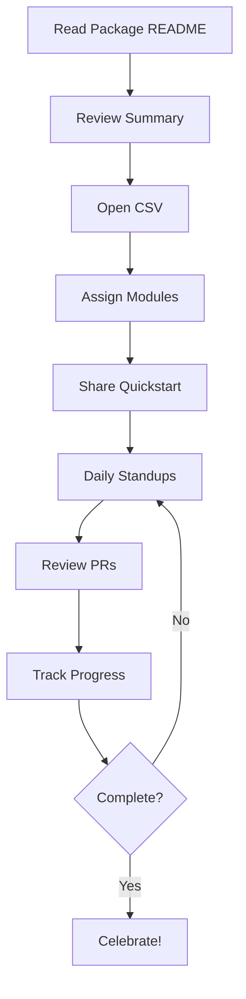

# Button Accessibility Implementation Package - Complete Index

## 📦 Package Contents

This package contains everything needed to fix 664 button accessibility issues across the ManufacturingOS application.

---

## 🗂️ Files Overview

### 📖 Documentation Files (7 files)

#### 1️⃣ **START HERE** → `BUTTON_ACCESSIBILITY_README.md`
```
Size: 11 KB
Type: Overview & Navigation
Audience: Everyone
```
**What it does:**
- Package overview and navigation guide
- Quick start paths for different roles
- Statistics and timelines
- Team coordination strategies

**When to use:** First file to read - directs you to the right resources

---

#### 2️⃣ **FOR DEVELOPERS** → `BUTTON_FIX_QUICKSTART.md`
```
Size: 9 KB
Type: Implementation Guide
Audience: Developers
Reading Time: 5 minutes
```
**What it does:**
- 5-minute getting started guide
- Icon-to-text cheat sheet (30+ patterns)
- Code examples for every scenario
- Testing instructions
- Complete workflow example

**When to use:** When you're ready to start coding immediately

---

#### 3️⃣ **FOR TRACKING** → `BUTTON_IMPLEMENTATION_GUIDE.csv`
```
Size: 111 KB
Type: Spreadsheet/Database
Audience: Project Managers, Team Leads
Format: CSV (Excel/Sheets compatible)
```
**What it does:**
- All 664 issues in spreadsheet format
- Columns: Module, File, Line, Icon, Suggested Text, Context
- Easy filtering and sorting
- Perfect for task assignment

**When to use:**
- Assigning work to team members
- Creating tickets in JIRA/Linear
- Tracking progress
- Generating reports

---

#### 4️⃣ **FOR IMPLEMENTATION** → `BUTTON_IMPLEMENTATION_GUIDE.md`
```
Size: 219 KB
Type: Detailed Step-by-Step Guide
Audience: Developers
Format: Markdown with checkboxes
```
**What it does:**
- Organized by module → file → line
- Code example for each button
- Interactive checkboxes
- Full context for every fix

**When to use:**
- Implementing fixes systematically
- Need detailed code examples
- Want to track progress with checkboxes
- Working through entire modules

---

#### 5️⃣ **FOR PLANNING** → `BUTTON_IMPLEMENTATION_SUMMARY.md`
```
Size: 9 KB
Type: Strategic Overview
Audience: Architects, Tech Leads, PMs
```
**What it does:**
- Statistics and breakdown by module
- Common patterns analysis
- Three implementation approaches compared
- Priority order (Phase 1-4)
- Best practices and standards
- Testing requirements
- Future-proofing strategies

**When to use:**
- Planning the implementation
- Making architectural decisions
- Setting coding standards
- Creating timelines and roadmaps

---

#### 6️⃣ **FOR REFERENCE** → `BUTTONS_CONTENT_AUDIT.md`
```
Size: 197 KB
Type: Original Audit Report
Audience: All (Reference)
Format: Technical audit data
```
**What it does:**
- Complete HTML snippets for each issue
- Detailed element descriptions
- Full context around buttons
- Original scan results

**When to use:**
- Need to see exact HTML code
- Context unclear from other docs
- Debugging specific issues
- Understanding why flagged

---

#### 7️⃣ **FOR REFERENCE** → `BUTTON_CONTENT_SPECIFICATION.md`
```
Size: 24 KB
Type: Specification Document
Audience: Reference
```
**What it does:**
- Original specification and requirements
- Background on the audit

**When to use:** Understanding the audit background

---

### 🔧 Tool Files (1 file)

#### 8️⃣ **AUTOMATION TOOL** → `parse_buttons_audit.py`
```
Size: 10 KB
Type: Python Script
Audience: Technical Leads, DevOps
```
**What it does:**
- Parses BUTTONS_CONTENT_AUDIT.md
- Extracts and maps button issues
- Generates CSV and Markdown guides
- Groups by module

**When to use:**
- Regenerating guides after audit updates
- Customizing output format
- Creating similar tools

**Usage:**
```bash
python parse_buttons_audit.py
```

---

## 🎯 Quick Navigation by Role

### 👨‍💻 **I'm a Developer - I want to fix buttons now**
1. Read: `BUTTON_FIX_QUICKSTART.md` (5 min)
2. Open: `BUTTON_IMPLEMENTATION_GUIDE.csv` → Filter to your module
3. Code: Use the cheat sheet patterns
4. Track: Check boxes in `BUTTON_IMPLEMENTATION_GUIDE.md`

**Time to first fix: < 10 minutes**

---

### 👔 **I'm a Project Manager - I want to plan and assign**
1. Read: `BUTTON_ACCESSIBILITY_README.md` (10 min)
2. Review: `BUTTON_IMPLEMENTATION_SUMMARY.md` → See priorities
3. Open: `BUTTON_IMPLEMENTATION_GUIDE.csv` → Assign tasks
4. Share: `BUTTON_FIX_QUICKSTART.md` with team

**Time to team mobilization: < 30 minutes**

---

### 🏗️ **I'm a Tech Lead - I want to set standards**
1. Read: `BUTTON_IMPLEMENTATION_SUMMARY.md` (20 min)
2. Review: Best practices section
3. Decide: Implementation approach
4. Set up: ESLint rules and components
5. Brief: Team on `BUTTON_FIX_QUICKSTART.md`

**Time to standards in place: < 2 hours**

---

### 📊 **I'm a Product Owner - I want to understand scope**
1. Read: `BUTTON_ACCESSIBILITY_README.md` (15 min)
2. Review: Statistics section
3. Check: Timeline and resource estimates
4. Plan: Sprint allocation

**Time to understand scope: < 20 minutes**

---

## 📊 Quick Statistics

```
┌─────────────────────────────────────────┐
│  BUTTON ACCESSIBILITY AUDIT SUMMARY     │
├─────────────────────────────────────────┤
│  Total Issues:          664             │
│  Files Affected:        288             │
│  Modules:               18              │
│  Est. Total Time:       15-20 hours     │
│  Avg. Time/Button:      ~2 minutes      │
└─────────────────────────────────────────┘
```

### Top 5 Modules by Priority

```
🔴 Phase 1: High Priority
├── CRM                 88 issues (34 files)
├── Procurement         54 issues (16 files)
└── CPQ                 45 issues (22 files)

🟡 Phase 2: Medium Priority
├── Logistics           39 issues (22 files)
├── Support             29 issues (15 files)
└── Inventory           27 issues (12 files)

🟢 Phase 3: Lower Priority
└── 12 other modules   382 issues (169 files)
```

---

## 🔄 Recommended Workflow

### For Individual Developer



**Steps:**
1. **Learn** → Read `BUTTON_FIX_QUICKSTART.md`
2. **Find** → Open `BUTTON_IMPLEMENTATION_GUIDE.csv`
3. **Filter** → Your assigned module
4. **Fix** → Add aria-labels using cheat sheet
5. **Test** → Keyboard nav + DevTools
6. **Commit** → With proper message
7. **Track** → Check boxes in Markdown guide
8. **Repeat** → Next file

---

### For Team Lead



**Steps:**
1. **Understand** → Read `BUTTON_ACCESSIBILITY_README.md`
2. **Plan** → Review `BUTTON_IMPLEMENTATION_SUMMARY.md`
3. **Assign** → Use `BUTTON_IMPLEMENTATION_GUIDE.csv`
4. **Train** → Share `BUTTON_FIX_QUICKSTART.md`
5. **Coordinate** → Daily standups
6. **Review** → PRs and progress
7. **Track** → Update CSV or checkboxes
8. **Report** → Generate metrics

---

## 📋 Common Patterns Cheat Sheet

```tsx
// 1. View Button
<button aria-label="View">
  <Eye className="h-4 w-4" />
</button>

// 2. Edit Button
<button aria-label="Edit">
  <Edit className="h-4 w-4" />
</button>

// 3. Delete Button
<button aria-label="Delete">
  <Trash2 className="h-4 w-4" />
</button>

// 4. Download Button
<button aria-label="Download">
  <Download className="h-4 w-4" />
</button>

// 5. Navigation Button
<button aria-label="Previous Month" onClick={prevMonth}>
  <ChevronLeft className="h-4 w-4" />
</button>

// 6. Context-Specific
<button aria-label={`View ${user.name}`}>
  <Eye className="h-4 w-4" />
</button>
```

---

## ✅ Success Checklist

### Project Setup
- [ ] All team members have read `BUTTON_ACCESSIBILITY_README.md`
- [ ] Developers have reviewed `BUTTON_FIX_QUICKSTART.md`
- [ ] Tasks assigned using `BUTTON_IMPLEMENTATION_GUIDE.csv`
- [ ] Progress tracking method decided
- [ ] PR review process established

### Implementation
- [ ] Phase 1 modules complete (CRM, Procurement, CPQ)
- [ ] Phase 2 modules complete (Logistics, Support, Inventory)
- [ ] Phase 3 modules complete (remaining modules)
- [ ] All 664 buttons have accessible labels
- [ ] All PRs reviewed and merged

### Quality Assurance
- [ ] Keyboard navigation tested
- [ ] Screen reader tested (sample)
- [ ] DevTools accessibility checks passed
- [ ] ESLint a11y rules passing
- [ ] No console warnings

### Documentation
- [ ] Coding standards updated
- [ ] Component library updated
- [ ] Team trained on best practices
- [ ] Future maintenance plan in place

---

## 🎓 Training Materials

### Day 1: Onboarding
**Duration:** 30 minutes

1. **Overview** (10 min)
   - Read `BUTTON_ACCESSIBILITY_README.md`
   - Review statistics and scope

2. **Technical Deep-Dive** (15 min)
   - Read `BUTTON_FIX_QUICKSTART.md`
   - Review cheat sheet
   - See code examples

3. **First Fix** (5 min)
   - Pick one simple button
   - Apply aria-label
   - Test in browser

### Day 2+: Implementation
- Daily standups
- PR reviews
- Progress tracking
- Q&A sessions

---

## 📞 Getting Help

### Question Types

**"How do I implement this?"**
→ See: `BUTTON_FIX_QUICKSTART.md`

**"What's the best practice?"**
→ See: `BUTTON_IMPLEMENTATION_SUMMARY.md`

**"What does this specific button do?"**
→ See: `BUTTONS_CONTENT_AUDIT.md`

**"How do we track progress?"**
→ See: `BUTTON_IMPLEMENTATION_GUIDE.csv`

**"What's our timeline?"**
→ See: `BUTTON_ACCESSIBILITY_README.md`

---

## 📈 Progress Tracking

### Option 1: CSV Method
1. Open `BUTTON_IMPLEMENTATION_GUIDE.csv`
2. Add columns: `Assigned To`, `Status`, `Date`
3. Update as you go
4. Generate reports from spreadsheet

### Option 2: Markdown Method
1. Use `BUTTON_IMPLEMENTATION_GUIDE.md`
2. Check `- [ ] Fixed` boxes
3. Commit changes
4. Track in git history

### Option 3: Issue Tracker
1. Import `BUTTON_IMPLEMENTATION_GUIDE.csv`
2. Create tickets in JIRA/Linear/GitHub
3. Track in project board
4. Link PRs to tickets

---

## 🎉 Milestones

- [ ] **25% Complete** (166 buttons) - 🥉 Bronze
- [ ] **50% Complete** (332 buttons) - 🥈 Silver
- [ ] **Phase 1 Done** (187 buttons) - ⭐ High Priority Complete
- [ ] **75% Complete** (498 buttons) - 🥇 Gold
- [ ] **100% Complete** (664 buttons) - 🏆 FULLY ACCESSIBLE!

---

## 📦 File Size Summary

```
Documentation:
├── BUTTON_ACCESSIBILITY_README.md       11 KB
├── BUTTON_FIX_QUICKSTART.md              9 KB
├── BUTTON_IMPLEMENTATION_SUMMARY.md      9 KB
├── BUTTON_CONTENT_SPECIFICATION.md      24 KB
└── IMPLEMENTATION_PACKAGE_INDEX.md      ~8 KB (this file)

Implementation Guides:
├── BUTTON_IMPLEMENTATION_GUIDE.csv     111 KB
└── BUTTON_IMPLEMENTATION_GUIDE.md      219 KB

Reference:
└── BUTTONS_CONTENT_AUDIT.md            197 KB

Tools:
└── parse_buttons_audit.py               10 KB

Total Package: ~600 KB
```

---

## 🚀 Ready to Start?

### Quick Start (5 minutes):
```bash
# 1. Read the quickstart
cat BUTTON_FIX_QUICKSTART.md

# 2. Open the CSV
excel BUTTON_IMPLEMENTATION_GUIDE.csv
# or
open BUTTON_IMPLEMENTATION_GUIDE.csv

# 3. Start fixing!
```

### Need More Context? Start Here:
1. **First time?** → `BUTTON_ACCESSIBILITY_README.md`
2. **Ready to code?** → `BUTTON_FIX_QUICKSTART.md`
3. **Planning?** → `BUTTON_IMPLEMENTATION_SUMMARY.md`
4. **Tracking?** → `BUTTON_IMPLEMENTATION_GUIDE.csv`

---

**Let's make ManufacturingOS accessible for everyone! 🌟**

---

*Package Version: 1.0*
*Generated: October 2024*
*Total Issues: 664 | Files: 288 | Modules: 18*
